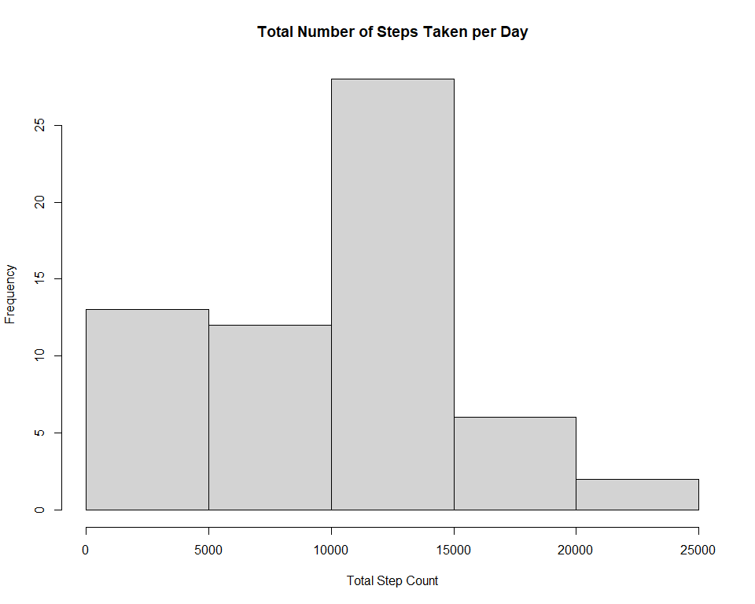
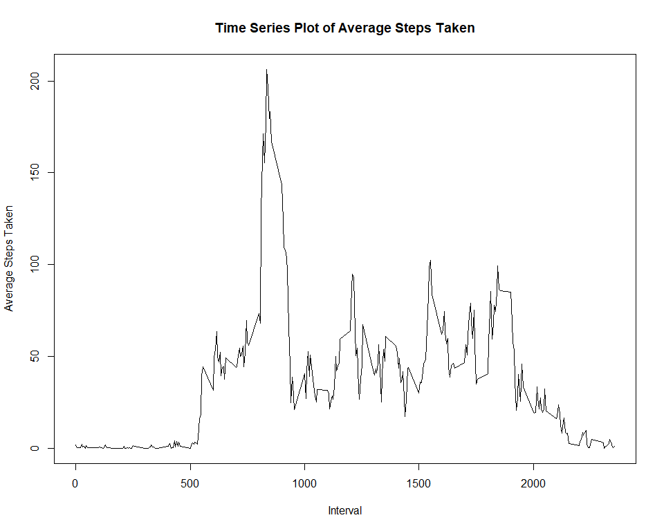
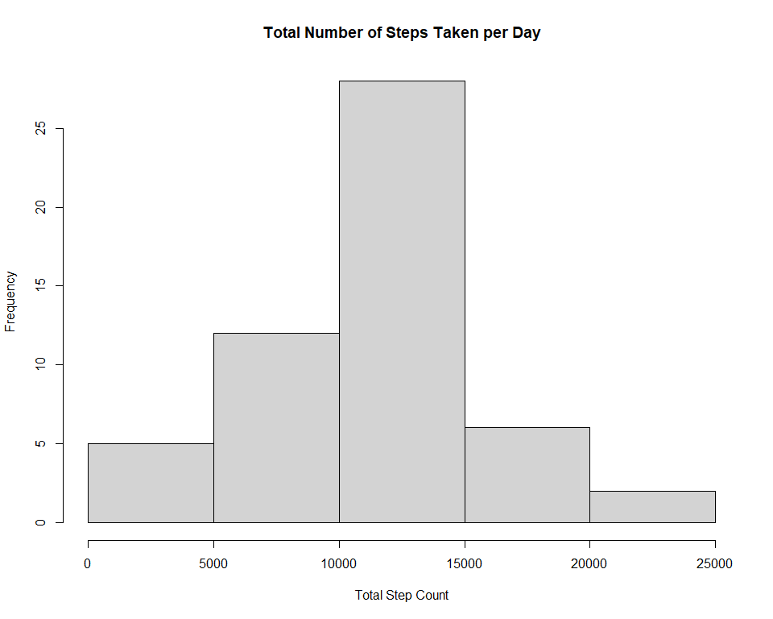
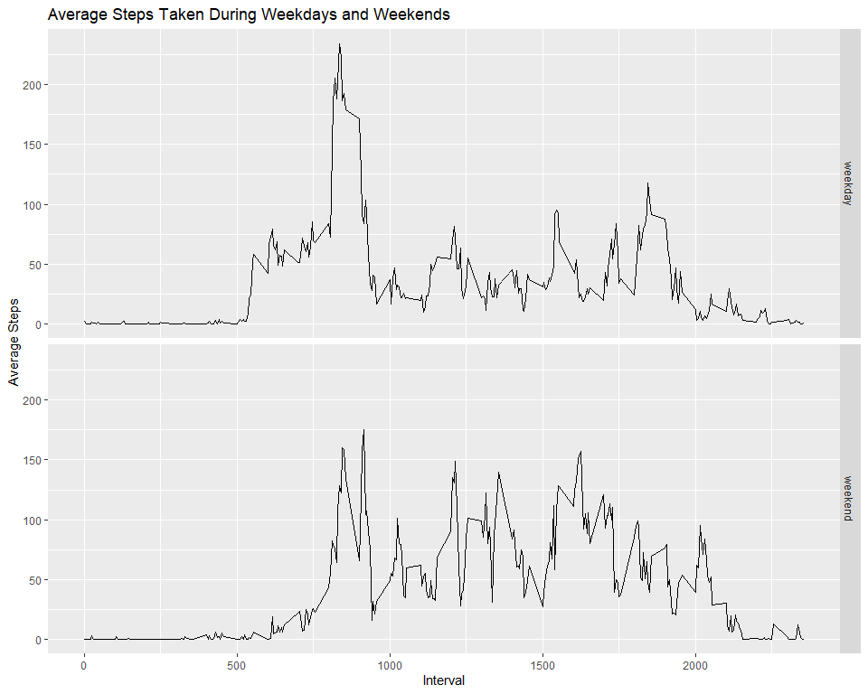

## Loading and preprocessing the data
First create teh file in your working directory, download the data, and unzip the file. 

```r
filename <- "activity.zip"
if (!file.exists(filename)){
        fileURL <- "https://d396qusza40orc.cloudfront.net/repdata%2Fdata%2Factivity.zip"
        download.file(fileURL, filename)
}
if (file.exists("activity.zip")) { 
        unzip(filename) 
}
```

Then read the data into R and change the class of the date column to "Date."

```r
activity <- read.csv("activity.csv")
activity$date <- as.Date(activity$date, format="%Y-%m-%d")
```

## What is mean total number of steps taken per day?
First, calculate the step sums per day and create a histogram.

```r
activity1 <- activity[!is.na(activity$steps),]
stepsums <- with(activity, tapply(steps, as.factor(activity$date), sum, na.rm = TRUE))

hist(stepsums, 
     main = "Total Number of Steps Taken per Day", 
     xlab = "Total Step Count",
     ylab = "Frequency")
```

<!-- -->

Then, look at the summary of the step sums for the median and mean. 

```r
summary(stepsums)
```

```
##    Min. 1st Qu.  Median    Mean 3rd Qu.    Max. 
##       0    6778   10395    9354   12811   21194
```

## What is the average daily activity pattern?
First, calculate the step means per interval and create a plot

```r
intervalmeans <- tapply(activity1$steps, activity1$interval, FUN=mean)
intervals <- levels(as.factor(activity1$interval))

plot(intervals, intervalmeans, 
     type = "l", 
     main = "Time Series Plot of Average Steps Taken",
     xlab = "Interval",
     ylab = "Average Steps Taken")
```

<!-- -->

Then calculate the interval with the most steps. 

```r
df_int <- data.frame(intervalmeans, intervals)
df_int[df_int$intervalmeans == max(df_int$intervalmeans), ][2]
```

```
##     intervals
## 835       835
```

## Imputing missing values
First, find missing values, calculate average number of steps, and impute into NAs.

```r
activity2 <- activity[is.na(activity$steps),]
meansteps <- with(activity2, tapply(steps, activity2$interval, mean))
activity2$steps <- meansteps
```

Next, make a new dataframe with fixed NAs.

```r
activity_fixed <- rbind(activity1, activity2)
activity_fixed <- activity_fixed[order(activity_fixed$date),]
```

Finally, replot steps taken per day with new dataframe and calulate the median and mean.

```r
stepsums_fixed <- with(activity_fixed, tapply(steps, as.factor(activity_fixed$date), sum))
hist(stepsums_fixed, 
     main = "Total Number of Steps Taken per Day", 
     xlab = "Total Step Count",
     ylab = "Frequency")
```

<!-- -->


```r
summary(stepsums)
```

```
##    Min. 1st Qu.  Median    Mean 3rd Qu.    Max. 
##       0    6778   10395    9354   12811   21194
```

```r
summary(stepsums_fixed)
```

```
##    Min. 1st Qu.  Median    Mean 3rd Qu.    Max.    NA's 
##      41    8841   10765   10766   13294   21194       8
```

## Are there differences in activity patterns between weekdays and weekends?
First, make new columns containing the day of the week and the designation of "weekday" or "weekend."

```r
activity_fixed$days <- weekdays(activity$date)

weekend <- grep("Saturday|Sunday", activity_fixed$days, ignore.case = TRUE)
weekend_dt <- activity_fixed[weekend, ]
weekend_dt$weekday <- "weekend"

weekdays <- grep("Monday|Tuesday|Wednesday|Thursday|Friday", activity_fixed$days, ignore.case = TRUE)
weekdays_dt <- activity_fixed[weekdays, ]
weekdays_dt$weekday <- "weekday"

activity_fixed <- rbind(weekend_dt, weekdays_dt)
```

Then create a plot of the average steps taken on weekdays and weekends.

```r
library(ggplot2)
stepmeans <- aggregate(steps ~ interval + weekday, activity_fixed, mean)

qplot(interval, steps, 
      data = stepmeans, 
      facets = weekday~., 
      geom = c("line"), 
      main = "Average Steps Taken During Weekdays and Weekends", 
      ylab = "Average Steps", 
      xlab = "Interval")
```

<!-- -->
